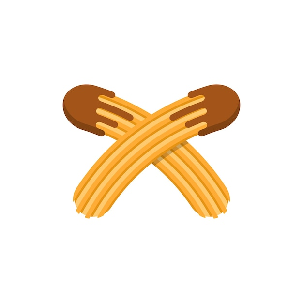

<p align="center">
  
</p>

# Churros — Open-source Donut clone for Slack

Self-hosted random coffee chat pairings for your Slack workspace — no subscription required.

## Features

- **Smart matching** — greedy algorithm avoids repeat pairs, prefers cross-department connections, and prioritizes users who were left out last round
- **Configurable frequency** — weekly, bi-weekly, or monthly pairings
- **170 built-in icebreaker questions** — one included in every intro DM
- **Snooze system** — skip pairings for 1–4 weeks, or permanently opt out; rejoin anytime
- **App Home tab** — self-service snooze/unsnooze via Slack UI (no commands needed)
- **Nudge reminders** — automatically messages silent pairs 3 days after intro if no one has replied
- **Welcome/farewell DMs** — greets new members when they join the channel, says goodbye when they leave
- **JSON file database** — zero external dependencies, data lives in a single file
- **Docker-ready** — multi-stage Dockerfile included, data persisted via volume

## Quick Start

**Prerequisites:** Node.js 20+, a Slack workspace where you can install apps

```bash
git clone https://github.com/your-org/churros.git
cd churros
npm install
cp .env.example .env
# Edit .env with your Slack credentials (see Slack App Setup below)
npm run dev
```

## Slack App Setup

### 1. Create the app

1. Go to [api.slack.com/apps](https://api.slack.com/apps) → **Create New App** → **From an app manifest**
2. Select your workspace
3. Paste the contents of [`manifest.json`](./manifest.json) and click **Next → Create**

### 2. Install to workspace

1. In the app settings, go to **OAuth & Permissions** → **Install to Workspace**
2. Approve the permissions

### 3. Copy credentials into `.env`

| Where to find it | `.env` variable |
|---|---|
| **OAuth & Permissions** → Bot User OAuth Token (`xoxb-…`) | `SLACK_BOT_TOKEN` |
| **Basic Information** → Signing Secret | `SLACK_SIGNING_SECRET` |
| **Basic Information** → App-Level Tokens → Generate Token (scope: `connections:write`) | `SLACK_APP_TOKEN` |

> **Socket Mode vs HTTP:** Socket Mode is enabled by default — no public URL required. If you omit `SLACK_APP_TOKEN`, the app falls back to HTTP mode on `PORT` (default `3000`) and you must configure Request URLs in the Slack dashboard.

### Required bot scopes

| Scope | Why |
|---|---|
| `channels:read` | List channel members |
| `channels:join` | Auto-join the configured channel |
| `groups:read` | Support private channels |
| `users:read` | Fetch user profile/department info |
| `im:write` | Open DMs |
| `im:history` | Read DM history for nudge detection |
| `mpim:write` | Open group DMs |
| `chat:write` | Send messages |
| `commands` | Register `/churros` slash command |

## Environment Variables

| Variable | Description | Default |
|---|---|---|
| `SLACK_BOT_TOKEN` | Bot User OAuth Token (`xoxb-…`) | *(required)* |
| `SLACK_SIGNING_SECRET` | App signing secret | *(required)* |
| `SLACK_APP_TOKEN` | App-level token for Socket Mode (`xapp-…`) | *(optional — HTTP mode if omitted)* |
| `PORT` | HTTP server port (HTTP mode only) | `3000` |
| `NODE_ENV` | `development` or `production` | `development` |
| `DB_PATH` | Path to the JSON database file | `./churros.json` |

## Usage — Slash Commands

All commands use `/churros`:

| Command | Description |
|---|---|
| `/churros enable` | Enable pairings for the current channel (bi-weekly by default) |
| `/churros enable <channel-id>` | Enable pairings for a specific channel |
| `/churros disable` | Pause pairings (config is preserved) |
| `/churros run` | Trigger a pairing round immediately |
| `/churros status` | Show current channel, frequency, and enabled state |
| `/churros frequency` | Pick pairing frequency via buttons (weekly / bi-weekly / monthly) |
| `/churros snooze [1-4]` | Skip pairings for 1–4 weeks (default: 2 weeks) |
| `/churros snooze off` | Permanently opt out of pairings |
| `/churros unsnooze` | Opt back in to pairings |

Users can also snooze/unsnooze themselves from the **App Home** tab without using commands.

## How It Works

### Matching algorithm

1. Eligible users (channel members minus snoozed/opted-out) are shuffled for fairness
2. Any user left unpaired last round is moved to the front of the queue
3. For each unpaired user, candidates are scored:
   - **Never met:** 10,000 points (always preferred)
   - **Recency:** days since last pairing (0–180 points)
   - **Cross-department bonus:** +50 points if different Slack profile departments
4. The highest-scoring candidate is paired, repeated until everyone is matched
5. Odd number of users: the last person is left out (tracked for priority next round)

### Scheduling

An hourly cron evaluates whether to run pairings:
- Matches config `day_of_week` and `hour_utc` (Monday 9:00 UTC by default)
- Enforces minimum gaps: bi-weekly ≥ 13 days, monthly ≥ 27 days

### Nudges

3 days after a pairing round, Churros checks each pair's DM. If no human has replied, it sends a gentle reminder to prompt them to meet.

### Snooze system

- **Temporary:** user is excluded from pairings until the snooze expiry date
- **Permanent opt-out:** user is excluded indefinitely; rejoined via `/churros unsnooze` or App Home

## Deployment (Docker)

```bash
# Build
docker build -t churros .

# Run (Socket Mode)
docker run -d \
  --name churros \
  -e SLACK_BOT_TOKEN=xoxb-... \
  -e SLACK_SIGNING_SECRET=... \
  -e SLACK_APP_TOKEN=xapp-... \
  -v churros-data:/data \
  churros

# Run (HTTP mode — expose port, set Request URL in Slack dashboard)
docker run -d \
  --name churros \
  -e SLACK_BOT_TOKEN=xoxb-... \
  -e SLACK_SIGNING_SECRET=... \
  -p 3000:3000 \
  -v churros-data:/data \
  churros
```

The database is stored at `/data/churros.json` inside the container. Mount a named volume (as above) or a host directory to persist data across restarts.

### Key rotation

**Bot Token (`xoxb-…`)**
1. Slack dashboard → **OAuth & Permissions** → **Reinstall App**
2. Copy the new token
3. Update `SLACK_BOT_TOKEN` in your env / container, restart the app

**Signing Secret**
1. Slack dashboard → **Basic Information** → **App Credentials** → **Regenerate**
2. Update `SLACK_SIGNING_SECRET` in your env / container, restart the app

**App Token (`xapp-…`)**
1. Slack dashboard → **Basic Information** → **App-Level Tokens** → revoke the old token → **Generate Token**
2. Update `SLACK_APP_TOKEN` in your env / container, restart the app

> Restart is required after any credential change — the Slack client authenticates at startup.

## Development

```bash
npm run dev      # Run with ts-node (watch not included — use nodemon if needed)
npm run build    # Compile TypeScript → dist/
npm run lint     # ESLint on src/**/*.ts
node dist/index.js  # Run compiled output
```

## Tech Stack

- [Node.js](https://nodejs.org/) 20 + [TypeScript](https://www.typescriptlang.org/) 5
- [@slack/bolt](https://github.com/slackapi/bolt-js) — Slack app framework
- [node-cron](https://github.com/node-cron/node-cron) — scheduling
- JSON file store — no external database

## License

MIT
